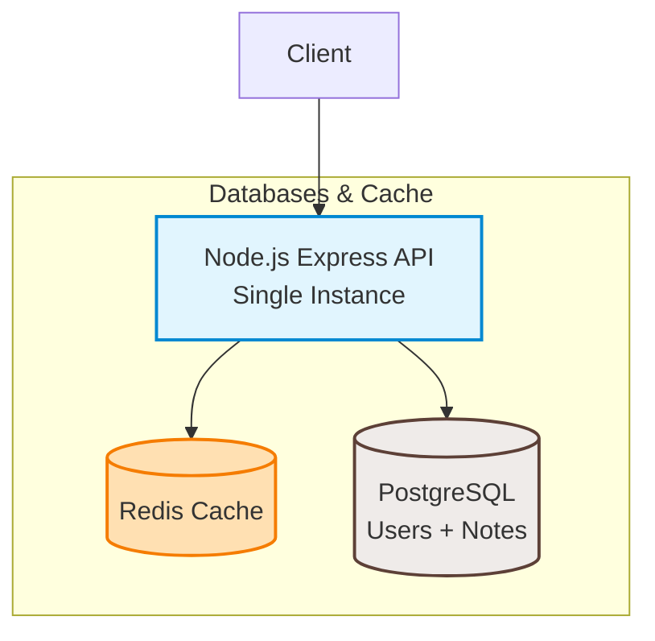

# Notch — System Design & Scaling Architecture

This document presents a comprehensive system design and scaling roadmap for Notch, transitioning from a single-instance development setup to a highly available, stateless, horizontally scaled architecture capable of serving **1 Million Users**.

---

## 1. System Overview & Current Architecture

Currently, Notch is deployed as a single-instance monolith. It uses a single **PostgreSQL** database (via Prisma) as the source of truth for both users and notes, with a foreign key from notes to users enforcing referential integrity. A single **Redis** instance is used as a cache-aside layer for notes.

### Current System Diagram


---

## 2. Statefulness & Local Resource Analysis: What Breaks?

If we deployed 3 instances of our Dockerized API behind a load balancer today, several in-memory stateful operations and local resource configurations would break:

### 2.1 In-Memory Rate Limiting
In [index.js](../index.js#L36-L41), we configure `express-rate-limit`:
```javascript
const apiLimiter = rateLimit({
    windowMs: 15 * 60 * 1000,
    max: 100,
    message: { success: false, message: 'Too many requests, try again later.' }
});
```
*   **Why it Breaks:** By default, it uses a local memory store. Request counts are isolated inside the Node.js process heap memory. A client's requests would be spread across the 3 instances, potentially allowing them to make up to **300 requests** instead of 100. Conversely, if a client is dynamically routed, they may face erratic rate-limiting behavior.
*   **Solution:** Move the rate-limiting store to our shared **Redis** instance using the `rate-limit-redis` package to track IP hit counts globally.

### 2.2 Local File Logging
In [utils/logger.js](../utils/logger.js#L32-L54), Winston writes to local container disks:
```javascript
transports: [
    new winston.transports.File({ filename: 'logs/error.log', level: 'error' }),
    new winston.transports.File({ filename: 'logs/combined.log' }),
]
```
*   **Why it Breaks:** Log files become fragmented across 3 isolated container filesystems. Tracking down errors requires manually SSHing into 3 servers and correlating logs by timestamp. Furthermore, container restarts destroy local logs. Sharing a mounted volume across nodes causes file-locking issues and log line interleaving.
*   **Solution:** Remove file-based transports in production. Log exclusively to `stdout`/`stderr` (Console) and let a log shipper (e.g., Fluentd, Loki, Datadog Agent) collect and aggregate them into a central logging database.

### 2.3 Database Connection Pool Exhaustion
In [utils/prisma.js](../utils/prisma.js), we instantiate the shared database pool:
```javascript
const pool = new Pool({ connectionString: process.env.DATABASE_URL, max: 10 });
const adapter = new PrismaPg(pool);
const prisma = new PrismaClient({ adapter });
```
*   **Why it Breaks:** Each API instance spins up its own database connection pool. If the primary Postgres database only allows 100 concurrent connections, and each of our 3 API instances uses its full pool, we consume connections fast. Scaling to more instances eventually crashes new nodes on startup due to connection rejection.
*   **Current mitigation & next step:** The pool already caps connections per instance (`max: 10`, overridable via `PG_POOL_MAX`). At higher scale, deploy a connection pooler like **PgBouncer** in front of PostgreSQL.

---

## 3. Scaling to 1M Users: Target Architecture

To support 1 Million Users, the system must undergo horizontal expansion at the API, database, cache, and processing levels.

### Target System Diagram
```mermaid
graph TD
    Client[Client] --> LB[Load Balancer <br> Least Connections]
    
    subgraph Stateless API Layer
        LB --> API1[API Instance 1]
        LB --> API2[API Instance 2]
        LB --> APIN[API Instance N]
    end

    subgraph Messaging & Background Tasks
        API1 -- Enqueue Job --> BullMQ[BullMQ / Redis Queue]
        API2 -- Enqueue Job --> BullMQ
        APIN -- Enqueue Job --> BullMQ
        BullMQ --> Worker1[Worker Node 1]
        BullMQ --> Worker2[Worker Node 2]
        Worker1 --> SMTP[SMTP Service]
        Worker2 --> S3[Object Storage / S3]
    end

    subgraph Caching & Rate Limiting
        API1 & API2 & APIN & Worker1 & Worker2 --> RedisCluster[(Redis Cluster <br> Cache & Rate Limiting)]
    end

    subgraph Relational Database (Users + Notes)
        API1 & API2 & APIN --> PG_Primary[(PostgreSQL Primary <br> Writes)]
        API1 & API2 & APIN --> PG_Replicas[(PostgreSQL Read Replicas <br> Reads)]
        PG_Primary -- Async Replication --> PG_Replicas
    end

    classDef stateless fill:#e1f5fe,stroke:#0288d1,stroke-width:2px;
    classDef database fill:#efebe9,stroke:#5d4037,stroke-width:2px;
    classDef cache fill:#ffe0b2,stroke:#f57c00,stroke-width:2px;
    classDef worker fill:#e8f5e9,stroke:#2e7d32,stroke-width:2px;
    classDef queue fill:#f3e5f5,stroke:#7b1fa2,stroke-width:2px;

    class API1,API2,APIN,LB stateless;
    class PG_Primary,PG_Replicas database;
    class RedisCluster cache;
    class Worker1,Worker2 worker;
    class BullMQ queue;
```

---

## 4. Architectural Scaling Strategies

### 4.1 Horizontal Scaling of the API & Load Balancing
*   **Load Balancing Algorithm — Least Connections:**
    *   *Why:* Our workload is non-uniform. CPU-intensive operations (such as bcrypt password hashing during registration on `/api/v1/users/register` or login on `/api/v1/users/login`) block the Node.js event loop for 50–100ms+. Simple note lookups (`GET /notes`) take less than 5ms. Round-Robin could dump multiple heavy bcrypt operations onto a single node, freezing it. **Least Connections** dynamically forwards requests to the instance processing the fewest active transactions.
*   **Stateless Execution:** API instances share zero local session state. Client authentication utilizes JSON Web Tokens (JWT) verified cryptographically or matched against centralized Redis session records.

### 4.2 Database Scaling: Read/Write Split & Replica Lag
To handle massive database traffic, we implement a **Primary-Replica split**:
*   **PostgreSQL Primary:** Receives all write transactions (`POST`, `PUT`, `DELETE`).
*   **PostgreSQL Read Replicas:** Handle all fetch traffic (`GET /notes`, user authorization checks).
*   **The Consistency Tradeoff (CAP Theorem):**
    *   Replication from the Primary to Replicas happens asynchronously to maintain fast write response times.
    *   This introduces **Replica Lag** (usually <100ms).
    *   Connecting back to the **CAP Theorem**, we choose **Availability (A)** and **Partition Tolerance (P)** over **Strict Consistency (C)**. The system guarantees *eventual consistency*. If a user edits a note and refreshes immediately, they might read from a replica that has not caught up yet and see the older note version for a fraction of a second. This is an acceptable trade-off for scalability.

### 4.3 Caching Optimization (AP Choice)
*   **Cache-Aside Pattern:** On `GET /notes`, we check the Redis cache first. If it's a miss, we fetch it from the database read replicas and populate Redis. On note modifications, we invalidate (delete) the Redis key.
*   **AP Framed Availability:** In the event of a network partition or replica database lag, the Redis cluster prioritizes serving cached notes quickly (Availability), favoring system availability over absolute consistency.

### 4.4 Asynchronous Processing via Message Queues
To keep HTTP transactions fast, we remove long-running side effects from the request lifecycle:
*   **Welcome Emails:** When a user registers, the API writes to PostgreSQL, enqueues a `send_welcome` job to a Message Queue (e.g., BullMQ using Redis, or RabbitMQ), and immediately returns a `201 Created` HTTP response.
*   **File/Image Attachments:** Note attachments are uploaded directly to an Object Storage system (e.g., Amazon S3) via pre-signed URLs, and file processing tasks are offloaded to background workers.
*   **Database Cushioning:** Queues regulate database writes during peak traffic times, preventing temporary load spikes from overwhelming the write databases.

---

## 5. Deployment Strategy: Dev vs. Production

### 5.1 Local Development (Docker Compose)
*   Coordinates local Docker containers for the API, Postgres, and Redis.
*   Uses a simple bridging network, making local development, integration testing, and system setup quick and deterministic.

### 5.2 Production Scaling (Container Orchestration)
To support 1 Million Users in production, we transition from Docker Compose to a Container Orchestrator like **Kubernetes (K8s)** or managed cloud services (e.g., **AWS ECS/Fargate**, **Google Cloud Run**):
*   **Auto-Scaling (HPA):** Automatically scales the number of stateless API replicas up or down based on real-time metric thresholds (e.g., average CPU utilization >70%).
*   **Self-Healing:** Monitors container health endpoints. If an instance becomes unresponsive or runs out of memory, the orchestrator terminates and replaces it.
*   **Zero-Downtime Deployments:** Handles rolling updates, ensuring that new API image releases are deployed incrementally without interrupting active client connections.
